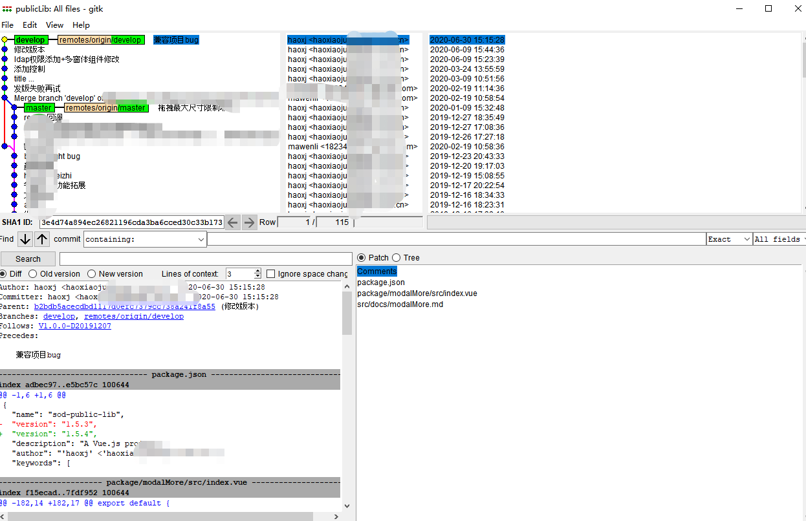

## 创建与合并分支

我们通过查看历史命令`git log --graph` 或者 `gitk` 或者其他图形化界面都可以看到，其实每次提交，Git都把它们串成一条时间线，这条时间线就是一个分支。截止到目前，只有一条时间线，在Git里，这个分支叫主分支，即master分支。HEAD严格来说不是指向提交，而是指向`master`，`master`才是指向提交的，所以，HEAD指向的就是当前分支。

### 常用命令

查看分支：`git branch`

创建分支：`git branch <name>`

切换分支：`git checkout <name>`或者`git switch <name>`

创建+切换分支：`git checkout -b <name>`或者`git switch -c <name>`

合并某分支到当前分支：`git merge <name> ` 

删除分支：`git branch -d <name>`

### HEAD 指向
一开始的时候，`master`分支是一条线，`Git`用`master`指向最新的提交，再用`HEAD`指向`master`，就能确定当前分支，以及当前分支的提交点：


每次提交，`master`分支都会向前移动一步，这样，随着你不断提交，`master`分支的线也越来越长。

当我们创建新的分支，例如dev时，`Git`新建了一个指针叫dev，指向`master`相同的提交，再把`HEAD`指向dev，就表示当前分支在dev上：


你看，`Git`创建一个分支很快，因为除了增加一个`dev`指针，改改`HEAD`的指向，工作区的文件都没有任何变化！

不过，从现在开始，对工作区的修改和提交就是针对`dev`分支了，比如新提交一次后，`dev`指针往前移动一步，而`master`指针不变：


假如我们在`dev`上的工作完成了，就可以把`dev`合并到`master`上。`Git`怎么合并呢？最简单的方法，就是直接把`master`指向`dev`的当前提交，就完成了合并：


所以Git合并分支也很快！就改改指针，工作区内容也不变！

合并完分支后，甚至可以删除`dev`分支。删除`dev`分支就是把`dev`指针给删掉，删掉后，我们就剩下了一条`master`分支：

### 实践
接下来我们来做一个闭合的操作

首先，我们创建`dev`分支，然后切换到`dev`分支：

```sh
$ git checkout -b dev
Switched to a new branch 'dev'
```
`git checkout`命令加上`-b`参数表示创建并切换，相当于以下两条命令

然后，用git branch命令查看当前分支：
```sh
$ git branch
* dev
  master
```
git branch命令会列出所有分支，当前分支前面会标一个*号。

然后，我们就可以在dev分支上正常提交，比如对readme.txt做个修改，加上一行然后提交：

```sh
$ git add readme.txt 
$ git commit -m "branch test"
[dev b17d20e] branch test
 1 file changed, 1 insertion(+)
```
现在，dev分支的工作完成，我们就可以切换回master分支：

```sh
$ git checkout master
Switched to branch 'master'
```
现在，我们把dev分支的工作成果合并到master分支上：

```sh
$ git merge dev
Updating d46f35e..b17d20e
Fast-forward
 readme.txt | 1 +
 1 file changed, 1 insertion(+)
 ```
`git merge`命令用于合并指定分支到当前分支。合并后，再查看readme.txt的内容，就可以看到，和`dev`分支的最新提交是完全一样的。

注意到上面的`Fast-forward`信息，`Git`告诉我们，这次合并是“快进模式”，也就是直接把`master`指向`dev`的当前提交，所以合并速度非常快。

合并完成后，就可以放心地删除dev分支了：
```sh
$ git branch -d dev
Deleted branch dev (was b17d20e).
```
删除后，查看`branch`，就只剩下master分支了

我们可以看一下gitk图形化界面张什么样,图像化界面可以让我们更清晰直观的看到它所有分支信息以及时间线的情况



## 解决冲突
人生不如意之事十之八九,我们组内开发，大家避免不了修改了同一个文件而发生冲突的，或者是自己与自己在不同分支并行开发，这是正常的

举例：
新建一个feature1分支
```sh
git checkout -b feature1
```
然后修改其readme文件->`add`->`commit`（略）

然后`checkout` 到 `master`分支

```sh
$ git switch master
Switched to branch 'master'
Your branch is ahead of 'origin/master' by 1 commit.
  (use "git push" to publish your local commits)
```
Git还会自动提示我们当前`master`分支比远程的`master`分支要超前1个提交。

在`master`分支同样 修改其readme文件->`add`->`commit`（略）

```sh
$ git merge feature1
Auto-merging readme.txt
CONFLICT (content): Merge conflict in readme.txt
Automatic merge failed; fix conflicts and then commit the result.
```
果然冲突了！Git告诉我们，readme.txt文件存在冲突，必须手动解决冲突后再提交。git status也可以告诉我们冲突的文件
```sh
$ git status
On branch master
Your branch is ahead of 'origin/master' by 2 commits.
  (use "git push" to publish your local commits)

You have unmerged paths.
  (fix conflicts and run "git commit")
  (use "git merge --abort" to abort the merge)

Unmerged paths:
  (use "git add <file>..." to mark resolution)

	both modified:   readme.txt

no changes added to commit (use "git add" and/or "git commit -a")
```
我们可以直接查看readme.txt的内容：

```sh
Git is a distributed version control system.
Git is free software distributed under the GPL.
Git has a mutable index called stage.
Git tracks changes of files.
<<<<<<< HEAD
Creating a new branch is quick & simple.
=======
Creating a new branch is quick AND simple.
>>>>>>> feature1
```
Git用<<<<<<<，=======，>>>>>>>标记出不同分支的内容（上半部分为当前分支修改，下半部分为传入更改） 根据需要进行修改继续提交流程即可

提价后可以，`git log --graph -n5`看历史

:::tip
以上为例子，但实际开发中，`master`通常只有项目负责人有权限操作，且代码与线上代码保持一致，

所以我们分支合入`master`前，请先将`master`（活其他公共父分支）更新至本地，并在自己的分支上进行`merge`操作，在个人分支进行处理冲突后，进行提交，再外向提交合并请求到需要合并的分支，借助`gitlab`等代码托管平台由其他同事或负责人进行`codeRview`后，进行合并处理
:::

## 分支管理策略

### merge 策略

:::tip

合并分支时，加上`--no-ff`参数就可以用普通模式合并，合并后的历史有分支，能看出来曾经做过合并，而`fast forward`合并就看不出来曾经做过合并。
:::

通常，合并分支时，如果可能，`Git`会用`Fast forward`模式，但这种模式下，删除分支后，会丢掉分支信息。

如果要强制禁用`Fast forward`模式，`Git`就会在`merge`时生成一个新的`commit`，这样，从分支历史上就可以看出分支信息。

下面我们实战一下`--no-ff`方式的git `merge`：

如何弄出来，`merge` 同上

准备合并dev分支，请注意`--no-ff`参数，表示禁用Fast forward：
```sh
$ git merge --no-ff -m "merge with no-ff" dev
Merge made by the 'recursive' strategy.
 readme.txt | 1 +
 1 file changed, 1 insertion(+)
```
因为本次合并要创建一个新的commit，所以加上-m参数，把commit描述写进去。


### 分支策略
在实际开发中，我们应该按照几个基本原则进行分支管理：

首先，master分支应该是非常稳定的，也就是仅用来发布新版本，平时不能在上面干活；

那在哪干活呢？干活都在dev分支上，也就是说，dev分支是不稳定的，到某个时候，比如1.0版本发布时，再把dev分支合并到master上，在master分支发布1.0版本；

你和你的小伙伴们每个人都在dev分支上干活，每个人都有自己的分支，时不时地往dev分支上合并就可以了。

所以，团队合作的分支看起来就像这样：


### Bug 分支
软件开发中，bug就像家常便饭一样。有了bug就需要修复，在Git中，由于分支是如此的强大，所以，每个bug都可以通过一个新的临时分支来修复，修复后，合并分支，然后将临时分支删除。

当你接到一个修复一个代号101的bug的任务时，很自然地，你想创建一个分支issue-101来修复它，但是，等等，当前正在dev上进行的工作还没有提交：

并不是你不想提交，而是工作只进行到一半，还没法提交，预计完成还需1天时间。但是，必须在两个小时内修复该bug，怎么办？

幸好，Git还提供了一个stash功能，可以把当前工作现场“储藏”起来，等以后恢复现场后继续工作：

```sh
$ git stash
Saved working directory and index state WIP on dev: f52c633 add merge
```
```sh
```
```sh
```
```sh
```
```sh
```
```sh
```
```sh
```
```sh
```
```sh
```
```sh
```
```sh
```
```sh
```
```sh
```
```sh
```
```sh
```
```sh
```
```sh
```
```sh
```
