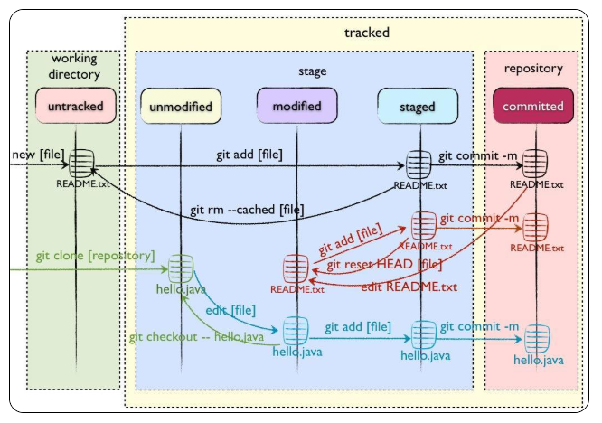

## 工作区、暂存区、版本库、远程仓库

Git和其他版本控制系统如SVN的一个不同之处就是有暂存区的概念

Git本地有四个工作区域：工作目录（Working Directory）、暂存区(Stage/Index)、资源库(Repository或Git Directory)、git仓库(Remote Directory)。文件在这四个区域之间的转换关系如下：


* Workspace： 工作区，就是你平时存放项目代码的地方
* Index / Stage： 暂存区，用于临时存放你的改动，事实上它只是一个文件，保存即将提交到文件列表信息
* Repository： 仓库区（或版本库），就是安全存放数据的位置，这里面有你提交到所有版本的数据。其中HEAD指向最新放入仓库的版本
* Remote： 远程仓库，托管代码的服务器，可以简单的认为是你项目组中的一台电脑用于远程数据交换

### 工作流程
git的工作流程一般是这样的：

１、在工作目录中添加、修改文件；

２、将需要进行版本管理的文件放入暂存区域；

３、将暂存区域的文件提交到git仓库。

因此，git管理的文件有三种状态：**已修改（modified）,已暂存（staged）,已提交(committed)**

### 文件的四种状态
版本控制就是对文件的版本控制，要对文件进行修改、提交等操作，首先要知道文件当前在什么状态，不然可能会提交了现在还不想提交的文件，或者要提交的文件没提交上。

GIT不关心文件两个版本之间的具体差别，而是关心文件的整体是否有改变，若文件被改变，在添加提交时就生成文件新版本的快照，而判断文件整体是否改变的方法就是用

* Untracked:   未跟踪, 此文件在文件夹中, 但并没有加入到git库, 不参与版本控制. 通过git add 状态变为Staged.

* Unmodify:   文件已经入库, 未修改, 即版本库中的文件快照内容与文件夹中完全一致. 这种类型的文件有两种去处, 如果它被修改, 而变为Modified.如果使用git rm移出版本库, 则成为Untracked文件

* Modified: 文件已修改, 仅仅是修改, 并没有进行其他的操作. 这个文件也有两个去处, 通过git add可进入暂存staged状态, 使用git checkout 则丢弃修改过,返回到unmodify状态, 这个git checkout即从库中取出文件, 覆盖当前修改

* Staged: 暂存状态. 执行git commit则将修改同步到库中, 这时库中的文件和本地文件又变为一致, 文件为Unmodify状态. 执行git reset HEAD filename取消暂存,文件状态为Modified

下面的图很好的解释了这四种状态的转变：



> 新建文件--->Untracked
>
> 使用add命令将新建的文件加入到暂存区--->Staged
>
> 使用commit命令将暂存区的文件提交到本地仓库--->Unmodified
> 
> 如果对Unmodified状态的文件进行修改---> modified
> 
> 如果对Unmodified状态的文件进行remove操作--->Untracked

## 四个区域常用命令

### 1、新建代码库
```sh
# 在当前目录新建一个Git代码库
 git init
# 新建一个目录，将其初始化为Git代码库
git init [project-name]
# 下载一个项目和它的整个代码历史
git clone [url]
```
### 2、查看文件状态
```sh
#查看指定文件状态
git status [filename]
#查看所有文件状态
git status
```
### 3、工作区<-->暂存区
```sh
# 添加指定文件到暂存区
git add [file1] [file2] ...
# 添加指定目录到暂存区，包括子目录
git add [dir]
# 添加当前目录的所有文件到暂存区
git add .
#当我们需要删除暂存区或分支上的文件, 同时工作区也不需要这个文件了, 可以使用（⚠️）
git rm file_path
#当我们需要删除暂存区或分支上的文件, 但本地又需要使用, 这个时候直接push那边这个文件就没有，如果push之前重新add那么还是会有。
git rm --cached file_path
#直接加文件名   从暂存区将文件恢复到工作区，如果工作区已经有该文件，则会选择覆盖
#加了【分支名】 +文件名  则表示从分支名为所写的分支名中拉取文件 并覆盖工作区里的文件
git checkout
```
###  4、工作区<-->资源库（版本库）
```sh
#将暂存区-->资源库（版本库）
git commit -m '该次提交说明'
#移除不必要的添加到暂存区的文件
git reset  --hard HEAD 文件名
#去掉上一次的提交（会直接变成add之前状态）
git reset  --hard HEAD^ 
#去掉上一次的提交（变成add之后，commit之前状态）  
git reset --soft  HEAD^ 
```
:::tip
用HEAD表示当前版本，上一个版本就是HEAD^，上上一个版本就是HEAD^^，当然往上100个版本写100个^比较容易数不过来，所以写成HEAD~100

reset --soft 会在重置 HEAD 和 branch 时，保留工作目录和暂存区中的内容，并把重置 HEAD 所带来的新的差异放进暂存区。
:::
### 5、远程操作
```sh
# 取回远程仓库的变化，并与本地分支合并
git pull
# 上传本地指定分支到远程仓库
git push
```
### 6、其它常用命令
```sh
# 显示当前的Git配置
git config --list
# 编辑Git配置文件
git config -e [--global]
#初次commit之前，需要配置用户邮箱及用户名，使用以下命令：
git config --global user.email "you@example.com"
git config --global user.name "Your Name"
#调出Git的帮助文档
git --help
#查看某个具体命令的帮助文档
git +命令 --help
#查看git的版本
git --version
```
## 工作区部分命令详解 

请打开你的 Git Bash 客户端 or 其他命令行工具
```sh
# 创建一个文件并写入123
echo 123 > a.txt
# 命令可以让我们时刻掌握仓库当前的状态
git status
```
看结果

```sh
λ git status
On branch master
Your branch is up-to-date with 'origin/master'.
Untracked files:
  (use "git add <file>..." to include in what will be committed)

        a.txt

nothing added to commit but untracked files present (use "git add" to track)
```
可以看到它现在工作区，git强大的提示，你的分支，你可以使用，`git add` 添加到暂存区进行跟踪

### add 命令

```sh
# 将文件的修改、文件的删除，添加到暂存区。
git add -u
# 将文件的修改，文件的新建，添加到暂存区。
git add .
# 将文件的修改，文件的删除，文件的新建，添加到暂存区。
git add -A
```
工作中一般是用到 `git add .` 或者 `git add -A`

`git add -A`相对于`git add -u`命令的优点：可以提交所有被删除、被替换、被修改和新增的文件到数据暂存区，而`git add -u` 只能操作跟踪过的文件

`git add -A` 等同于`git add -all`

然而看了半天，发现 `git add .|-A|--all` 这三个选项都可以把所有的操作文件创建，文件修改，文件删除 添加到暂存区 git高版本都一样可以

```sh
λ git add .
warning: LF will be replaced by CRLF in a.txt.
The file will have its original line endings in your working directory.
λ git status
On branch develop
Your branch is up-to-date with 'origin/develop'.
Changes to be committed:
  (use "git reset HEAD <file>..." to unstage)

        new file:   a.txt
```

### commit 命令

用git commit提交更改，实际上就是把暂存区的所有内容提交到当前分支

```sh
λ git commit -m"test"
[develop 9176eec] test
 1 file changed, 1 insertion(+)
 create mode 100644 a.txt
λ git status
On branch develop
Your branch is ahead of 'origin/develop' by 1 commit.
  (use "git push" to publish your local commits)
nothing to commit, working tree clean
```
你可以看到git清晰的提示，你可以`git push`你的本地commits

当然你如果不想要这次提交也可以

`git reset --hard HEAD^` 就可以充值会上一次提交，注意本地修改就意味这也清空了，慎用

如果还想要本地修改那么 `git reset --soft  HEAD^ `

commit 和 add 是可以一起使用，也就是说不经过暂存区直接放到本地版本库中
`git -am "提交描述"`

### push 命令
```sh
git push origin master:master #本地仓库master分支推动到远程仓库的master分支
git push origin master　　　　　 #本地仓库当前分支的推送到master分支
git push 　　　　　　　　　　　 #将当前本地仓库所在分支提交到远程相同分支下
```
1. git push origin master:master 这个是完整版本。：前面的是本地分支名称，：后面的是远端分支的名称。
2. git push origin master，后面没带远端的master，那是因为git已经为本地的master分支和远端的分支建立了所谓的 upstream 的关联，它知道本地master对应远端的master分支。当然，git也允许我们修改本地分支的 upstream。可以看看 git branch --set-upstream 命令。
3. 因为 origin 是缺省的 remote url；

### pull 命令

同push命令 

如果缺省写法`git pull` 相当于执行

```sh
# 更新远程分支到本地
git fetch 
# merge
git merge
```
## 版本回退

### log历史查询

```sh

```

```sh

```

```sh
#如果出现:将不必要的文件commit 或者 上次提交觉得是错的  或者 不想改变暂存区内容，只是想调整提交的信息
```

```sh

```

```sh

```

```sh

```

```sh

```

```sh

```

```sh

```

